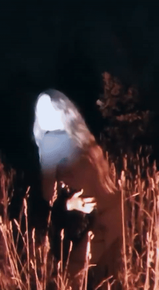
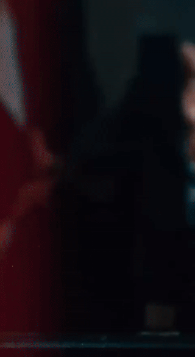

# 🎬 Видеоклипы (музыкальные видео)

## Описание работы

Монтаж музыкальных видеоклипов — от синхронизации кадров с ритмом трека до финального цветокора и графики. Опыт получен во время работы в видео/контент-студии **Purple Hood** (2022–2024), где я в команде занимался монтажом клипов для музыкальных исполнителей.

Задача такого монтажа — не просто склеить кадры, а превратить отснятый материал в динамичную историю, которая держит зрителя за счёт ритма, смены планов и визуальных акцентов, синхронизированных с музыкой.

## Как это делается (пошагово)

1. **Разбор материала.** Просматриваю все дубли и отснятый футаж, отмечаю лучшие кадры, ракурсы и эмоции артиста.
2. **Синхронизация с треком.** Раскладываю аудиодорожку в Adobe Premiere Pro, расставляю маркеры на битах, акцентах и смене частей трека (куплет/припев/бридж).
3. **Черновой монтаж (rough cut).** Собираю основную структуру клипа по маркерам — под каждый акцент трека подбирается свой кадр или смена плана.
4. **Ритмический монтаж.** Ускоряю или замедляю темп нарезки в зависимости от энергии музыки: быстрые резкие склейки на дропах, более медленные и плавные — в лиричных частях.
5. **Графика и эффекты в After Effects.** Добавляю переходы, VHS/light leak эффекты, текстовые вставки (название трека, автора), motion-эффекты под конкретные акценты.
6. **Цветокоррекция.** Привожу все кадры к единому визуальному стилю (тон, контраст, насыщенность) под настроение трека.
7. **Сведение звука.** Проверяю громкость, при необходимости добавляю звуковые эффекты (свуши, удары) для усиления динамики монтажа.
8. **Финальный рендер и экспорт** в форматах под YouTube/соцсети.

## Примеры работ

**Видеоклип 1**

**Видеоклип 2**

