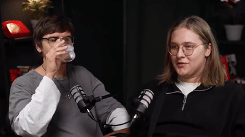
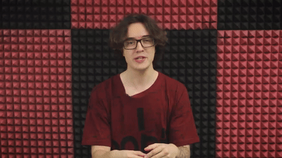

# 🎙️ Подкасты, векторная графика и муд-нарезки

## Описание работы

Этот раздел объединяет три смежных направления, которые часто идут в одной связке в продакшене контента:

- **Монтаж подкастов** — мультикам сборка выпусков.
- **Векторная графика** — обложки, иконки, заставки и элементы оформления для видео и соцсетей.
- **Муд-нарезки** — короткие атмосферные видео-нарезки без строгого сюжета, передающие настроение (для рекламы, соцсетей, промо).

## Пошагово

### Подкасты 
1. Синхронизирую все камеры и звуковые дорожки по общей аудио- или видео-метке (хлопок, общий звук).
2. Собираю мультикам-секвенцию в Adobe Premiere Pro — все ракурсы кладутся на отдельные видеодорожки одной временной шкалы.
3. В режиме мультикам-монтажа переключаюсь между ракурсами в реальном времени под живую речь: крупный план говорящего, общий план, реакция собеседника.
4. Чищу звук, выравниваю громкость голосов, убираю шумы и паузы-заминки.
5. Добавляю титры с именами спикеров, брендированную рамку/логотип, финальный цветокор.

### Векторная графика
1. Прорабатываю концепт в Adobe Illustrator — палитра, стиль, композиция под бренд/тему.
2. Строю иллюстрацию или иконки в векторе (обложка подкаста, титульные карточки, элементы для motion-дизайна).
3. Экспортирую графику в нужных форматах для дальнейшей анимации в After Effects или использования как статичный материал.

### Муд-нарезки
1. Отбираю самые атмосферные, визуально сильные кадры из отснятого материала.
2. Подбираю музыку/звук под настроение, которое нужно передать.
3. Монтирую в свободном ритме — без жёсткой сюжетной привязки, акцент на визуальную эстетику и плавные переходы.
4. Финальный цветокор и графика (текст, лого) при необходимости.

## Примеры работ

**Подкаст (мультикам-монтаж)**

**Муд-нарезка**

