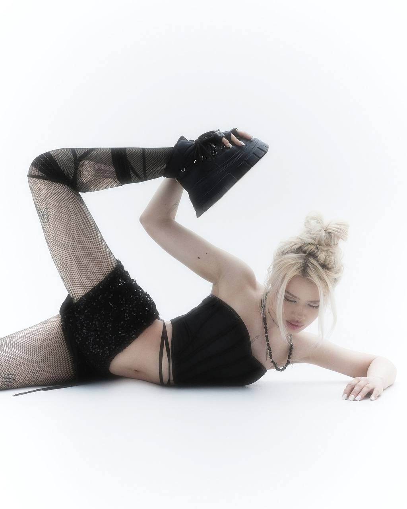
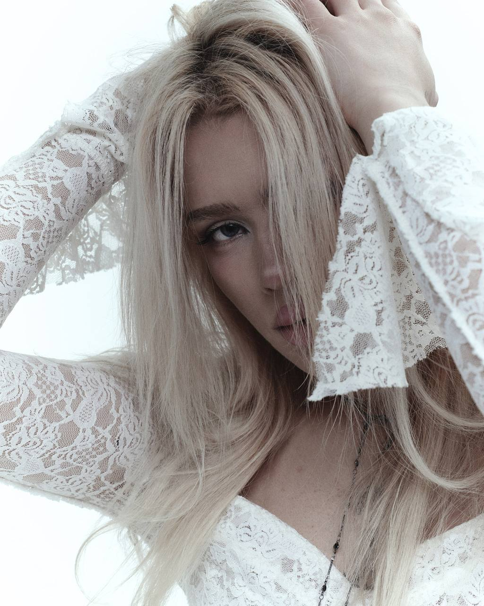
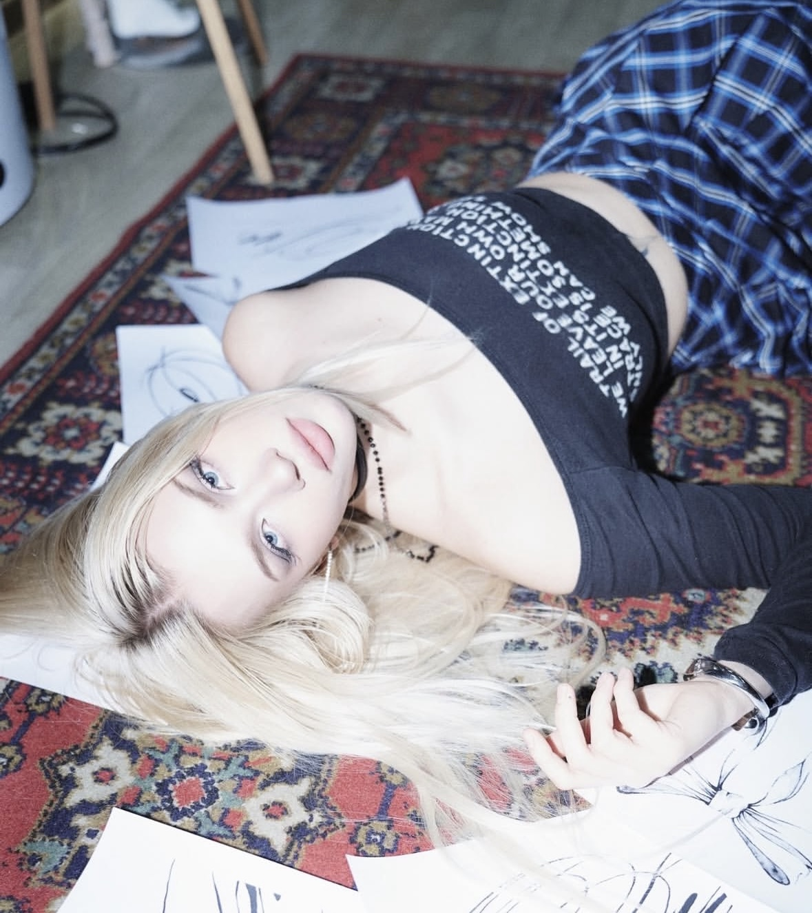
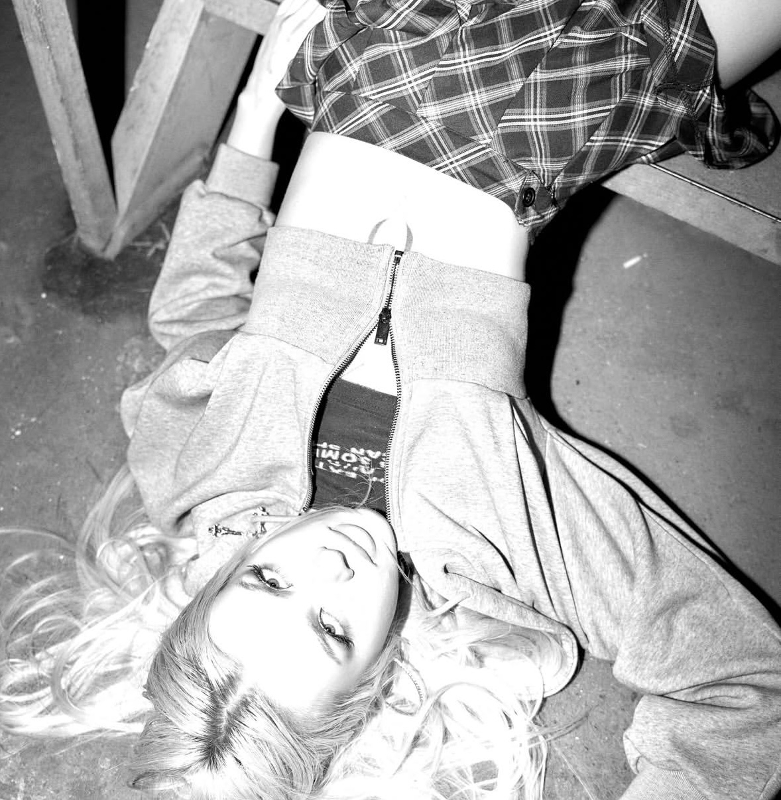

# 📸 Фото

## Описание работы

Фотографии — часть общего контент-продакшена: съёмка и последующая обработка кадров для соцсетей, промо-материалов и портфолио. Фото часто снимаются в связке с видео на одних и тех же съёмках (для афиш, постов, обложек).

## Пошагово

1. **Подготовка к съёмке.** Продумываю кадр совместно с видео-съёмкой: свет, ракурс, композицию, чтобы фото и видео дополняли друг друга по стилю.
2. **Съёмка.** Делаю серию кадров с разными ракурсами и планами, чтобы на этапе отбора было из чего выбрать лучший вариант.
3. **Отбор кадров.** Просматриваю все снимки, выбираю наиболее удачные по композиции, свету и эмоции.
4. **Обработка (ретушь и цветокоррекция).** Довожу фото до финального вида — коррекция экспозиции, баланса белого, контраста, при необходимости лёгкая ретушь.
5. **Приведение к единому стилю.** Если фото идут сериями (например, для одного проекта или клиента), привожу цветовую обработку к единому визуальному стилю.
6. **Экспорт** в нужных форматах и разрешениях под конкретную задачу (соцсети, печать, сайт).

## Примеры работ

